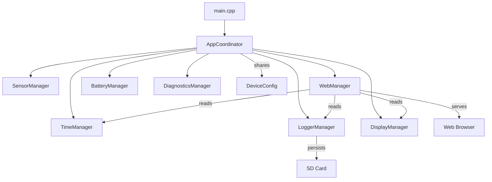

# TempSensor — Project Overview

## What is it?

An **ESP8266-based indoor environmental monitor** built on a LOLIN D1 Mini Pro, running PlatformIO + Arduino. It samples temperature, humidity, and pressure via a BME280 sensor, logs to an SD card, displays on a 64×48 OLED, monitors battery state, and hosts a full-featured local web dashboard.

---

## Hardware

| Component | Detail |
|---|---|
| Board | LOLIN D1 Mini Pro v2.0.0 (ESP8266, 80KB RAM, ~1MB flash) |
| Sensor | BME280 on I²C (D1/D2, addr `0x76`) |
| Display | SSD1306 OLED Shield 64×48 |
| Storage | microSD Card Shield (SPI, CS rerouted to GPIO16/D0) |
| Power | LiPo battery with charge state detection via ADC |

---

## Architecture



### Component Responsibilities

| Component | File | Lines | Role |
|---|---|---|---|
| **AppCoordinator** | [AppCoordinator.cpp](file:///home/drewfus/TempSensor/src/app/AppCoordinator.cpp) | 343 | Central orchestrator: boot sequence, main loop, sampling cadence, flush scheduling, Wi-Fi/NTP monitoring, OTA setup, SD recovery, battery logging |
| **WebManager** | [WebManager.cpp](file:///home/drewfus/TempSensor/src/managers/WebManager.cpp) | **3,874** | HTTP server, REST APIs, **~2,880 lines of inline PROGMEM HTML/CSS/JS**, Wi-Fi AP fallback, OTA upload handler |
| **LoggerManager** | [LoggerManager.cpp](file:///home/drewfus/TempSensor/src/managers/LoggerManager.cpp) | 779 | SD card I/O: binary daily log files (slot-indexed by second-of-day), circular battery log, events CSV, config JSON, timestamp calibration, recovery with exponential backoff |
| **BatteryManager** | [BatteryManager.cpp](file:///home/drewfus/TempSensor/src/managers/BatteryManager.cpp) | 253 | ADC reading (8-sample average + EMA), LiPo piecewise-linear voltage→percent, dual-hysteresis charge state machine, adaptive discharge rate learning |
| **DisplayManager** | [DisplayManager.cpp](file:///home/drewfus/TempSensor/src/managers/DisplayManager.cpp) | 349 | SSD1306 rendering: 5-line live readout, boot splash, OTA progress bar, custom 4×5px tiny-font for IP address, rotating status line |
| **TimeManager** | [TimeManager.cpp](file:///home/drewfus/TempSensor/src/managers/TimeManager.cpp) | 82 | NTP sync with POSIX timezone via `configTzTime`, estimated timestamps via uptime, re-establishment flag for log calibration |
| **SensorManager** | [SensorManager.cpp](file:///home/drewfus/TempSensor/src/managers/SensorManager.cpp) | 80 | BME280 init + read with simulation fallback if sensor not found |

---

## Data Model

### Models ([include/models/](file:///home/drewfus/TempSensor/include/models))

| Struct | Size | Purpose |
|---|---|---|
| [Sample](file:///home/drewfus/TempSensor/include/models/Sample.h) | ~48B | Live sensor reading + timestamp + quality |
| [LogRecord](file:///home/drewfus/TempSensor/include/models/Sample.h#L23-L29) | 17B (packed) | Binary on-disk sensor record, indexed by second-of-day in daily `.bin` files |
| [BatteryRecord](file:///home/drewfus/TempSensor/include/models/Sample.h#L31-L37) | 14B (packed) | Circular battery log entry (2,880 slots = 48hrs at 1min intervals) |
| [DeviceConfig](file:///home/drewfus/TempSensor/include/models/DeviceConfig.h) | ~200B | Persistent settings: WiFi, hostname, timezone, intervals, lat/lon, battery baseline |
| [SystemHealth](file:///home/drewfus/TempSensor/include/models/SystemHealth.h) | ~40B | Heap, queue, battery, connectivity status |
| [RingBuffer\<Sample, 128\>](file:///home/drewfus/TempSensor/include/utils/RingBuffer.h) | ~6.1KB static | In-RAM sample queue between sampling and SD flush |

### SD Card File Layout

```
/config.json              — persistent device configuration
/logs/
  YYYY-MM-DD.bin          — daily sensor log (86,400 × 17B = 1.43MB pre-allocated)
  battery.bin             — circular 2,880-record battery history (40.3KB)
  events.csv              — system event timeline (CSV: timestamp, quality, event)
  estimated.bin           — temporary pre-NTP sensor records (calibrated + moved on NTP sync)
  data.csv                — legacy CSV log (header only now)
```

---

## Web Dashboard & API

### API Routes (18 endpoints)

| Method | Route | Handler |
|---|---|---|
| GET | `/` | Serves ~130KB PROGMEM HTML SPA |
| GET | `/sys/uplot.js` | Gzipped uPlot JS from PROGMEM |
| GET | `/sys/uplot.css` | Gzipped uPlot CSS from PROGMEM |
| GET | `/api/live` | Latest sensor sample JSON |
| GET | `/api/health` | System health + battery JSON |
| GET | `/api/config` | Current device config JSON |
| POST | `/api/config` | Update config (reboot if WiFi/hostname changed) |
| GET | `/api/history?start=...&end=...` | Binary stream of `LogRecord`s from daily files |
| GET | `/api/events?limit=N` | Events JSON (backward-scan for latest N) |
| GET | `/api/logs` | List files in `/logs/` |
| GET | `/api/logs/download?file=...` | Download any SD file |
| POST | `/api/logs/delete?file=...` | Delete file or empty directory |
| POST | `/api/logs/rename?file=...&new_name=...` | Rename file/directory |
| GET | `/api/sd-tree` | Recursive SD card tree JSON |
| POST | `/api/action/flush-now` | Force RAM→SD flush |
| POST | `/api/action/ntp-retry` | Trigger NTP re-sync |
| POST | `/api/update` | Web OTA firmware upload |

### Dashboard Features
- **Glassmorphism dark theme** with Google Fonts (Outfit + JetBrains Mono)
- **uPlot** charts for sensor history + battery voltage with solar sunrise/sunset markers
- **Priority scheduler**: single 10s tick, one task per tick, Maximum-Overdue-First with static tie-breaking
- **Global fetch lockout** (`isFetching`) prevents concurrent ESP8266 HTTP calls
- **Per-card force-refresh** buttons with micro-animations
- **SD File Explorer** with download/rename/delete
- **Settings panel** with dynamic timezone, interval, and network config
- **Event timeline** with chronological reverse ordering

---

## Build Status

| Metric | Value |
|---|---|
| RAM | 57.1% (46,788 / 81,920 bytes) |
| Flash | 50.7% (529,528 / 1,044,464 bytes) |
| Build | `pio run` — zero warnings/errors |
| Upload | OTA via `espota` to `tempsensor-d1mini.local` |

---

## Milestones Completed (1–4)

1. **Sensor + SD + OLED + WiFi** — basic sampling and display
2. **Web dashboard** — live/history/health/settings/download
3. **OTA, stability, battery diagnostics** — soldered stack, charge state tracking, retroactive timestamp correction
4. **Persistent config, SD explorer, AP fallback, binary logging, event timeline, battery predictions, SD recovery**

---

## Current Milestone: **5 — Code Review, Refactoring & Memory Optimization**

Per [NextSessionHandoff.md](file:///home/drewfus/TempSensor/NextSessionHandoff.md):

1. **Code Comprehension & Walkthrough** — document component interactions ✅ *(this document)*
2. **Structural Code Improvements** — decouple the 2,880-line PROGMEM HTML from API routing in WebManager, standardize interfaces
3. **Memory & Heap Analysis** — map static/dynamic allocations, identify fragmentation risks, analyze stack depths

> [!IMPORTANT]
> The biggest structural issue is [WebManager.cpp](file:///home/drewfus/TempSensor/src/managers/WebManager.cpp) at **3,874 lines / 130KB**, with ~2,880 lines being a single PROGMEM HTML literal containing all CSS + JavaScript inline. This is the primary refactoring target.
